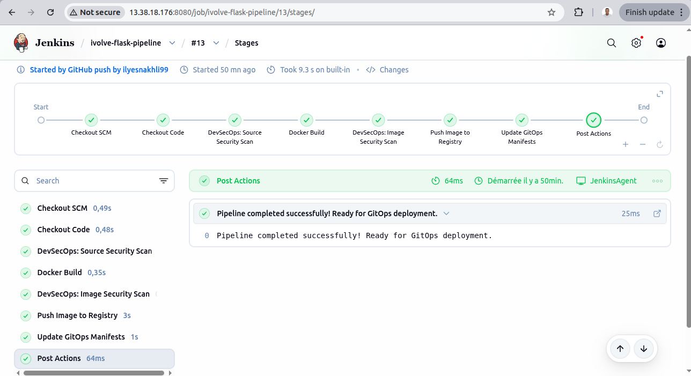
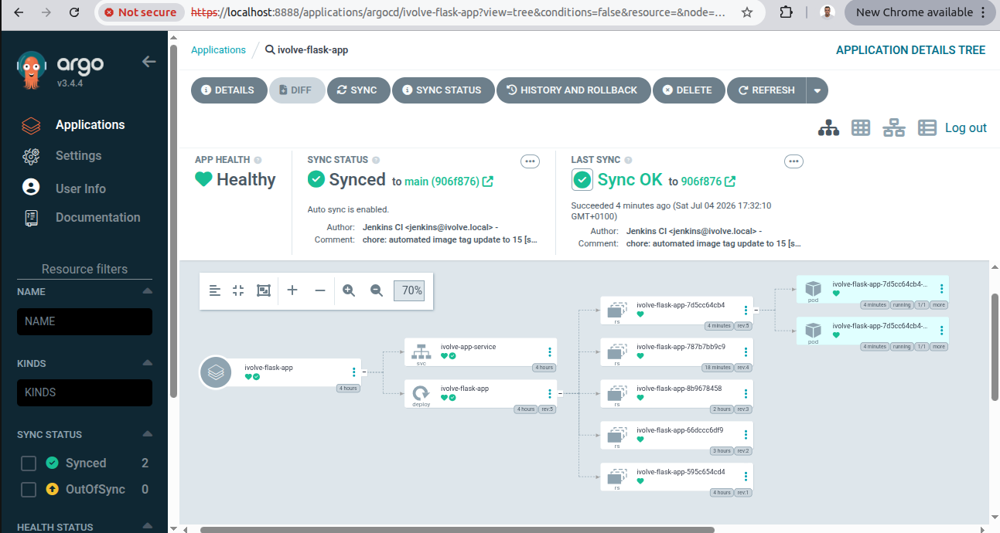

# End-to-End DevSecOps Project on AWS

A comprehensive, enterprise-grade CI/CD infrastructure for containerized applications. This project leverages **Terraform** for Infrastructure as Code (IaC), **Ansible** for automated configuration management, **Jenkins** for continuous integration, and **ArgoCD** for GitOps-based continuous deployment to an Amazon EKS cluster, backed by **CloudWatch** and **SNS** for infrastructure monitoring.

---

## 📊 System Architecture Diagram

Below is the dynamic, end-to-end architecture flow showing how code moves from an engineer's workstation to a secure AWS environment.


---

## 🏗️ Project Architecture Breakdown

### 1. ☁️ AWS Infrastructure (Terraform Provisioned)
The core infrastructure is designed around a secure multi-tier **Virtual Private Cloud (VPC)** to isolate production compute nodes from the public internet.
* **Public Subnet:** Hosts public-facing entry points including the **AWS Load Balancer** and two EC2 instances running **Jenkins Master** and **Jenkins Agent**.
* **Private Subnet:** Hosts the **Amazon EKS Worker Nodes** in total network isolation, ensuring application pods are safe from direct internet scanning.
* **Global AWS Layer:** Configured **AWS CloudWatch** metrics tracking tied to **AWS SNS** topics to handle immediate threshold breach alerts.

### 2. ⚙️ Configuration Management (Ansible)
Instead of manually installing dependencies, **Ansible Playbooks** were used to programmatically SSH into the newly provisioned EC2 instances to establish identical, repeatable environments:
* Configured the **Jenkins Master** runtime, security parameters, and plugins.
* Provisioned the **Jenkins Agent** with build dependencies, Docker runtimes, and security scanning binaries.

### 3. ☸️ Kubernetes Environment (Amazon EKS)
* **Control Plane:** Fully managed by AWS in an isolated layer to orchestrate the cluster.
* **Worker Nodes:** Consists of 2 Managed EC2 Worker Nodes (`t3.medium`) deployed inside the Private Subnet to host application namespaces.
* **Compute Isolation:** Handles all containerized runtime tasks, keeping the underlying app fully abstracted away from the network edge.

---

## 🔄 End-to-End GitOps CI/CD Pipeline Flow



The deployment pipeline is strictly automated from code push to active deployment via two distinct loops:

### The CI Loop (Jenkins)
1. **Developer Push:** An engineer pushes code updates to the public **GitHub** repository.
2. **Webhook Trigger:** GitHub securely sends an event to the **Jenkins Master**, which delegates the workload.
3. **Agent Compilation:** The **Jenkins Agent** spins up to run unit tests, uses **Trivy** to scan for vulnerabilities, and compiles the final Docker image.
4. **Registry Push:** The safe container image is pushed directly to **Docker Hub** with a unique tracking tag.
5. **Manifest Update:** Jenkins automatically updates the deployment image tag inside the Kubernetes manifest repository and commits the changes back to GitHub.

### The CD Loop (ArgoCD GitOps)



6. **GitOps Synchronization:** **ArgoCD**, running natively inside the EKS cluster, continuously monitors the manifest repository for differences.
7. **Automated Reconciliation:** Upon detecting the new image tag commit, ArgoCD pulls the changes and smoothly rolls out the updated **Flask App Pods** across the worker nodes with zero downtime.

---

## 📊 Infrastructure Monitoring Loop

To ensure high availability and proactive operations:
1. **Metrics Streaming:** EKS worker nodes continuously push runtime and container performance statistics upward to **AWS CloudWatch**.
2. **Threshold Alarms:** CloudWatch is configured with metric alarms (e.g., CPU utilization crossing 70%).
3. **Notification Routing:** If an alarm is tripped, it targets an **AWS SNS Topic** which instantly broadcasts an automated alert email straight to a **Gmail Inbox** for immediate engineer triage.

---

## 📁 Repository Directory Structure

```text
ivolve-devops-project/
│
├── .gitignore              # Global security filters (ignores .tfstate, caches, secrets)
├── README.md               # Detailed project portfolio documentation
├── Jenkinsfile             # CI pipeline configuration defining stages
├── Dockerfile              # Flask application containerization blueprint
│
├── Terraform/              # Infrastructure-as-Code definitions
│   ├── providers.tf        # AWS provider & region specifications (eu-west-3)
│   ├── vpc.tf              # Multi-tier network topology configurations
│   ├── eks.tf              # EKS Cluster, IAM roles, and Managed Node Groups
│   ├── compute.tf          # Jenkins EC2 instance definitions
│   ├── monitoring.tf       # CloudWatch alarms and SNS notification bindings
│   └── variables.tf        # Variable blueprints
│
├── Ansible/                # Server automated baseline configurations
│   ├── playbooks/          # Target execution playbooks for Jenkins orchestration
│   └── inventory.ini       # Managed node assignments
│
├── app/                    # Web application module
│   └── app.py              # Main Flask microservice source code
│
└── Kubernetes/             # Declarative deployment state
    ├── deployment.yaml     # Application cluster footprint specification
    └── service.yaml        # Service mesh exposing NodePorts internally
